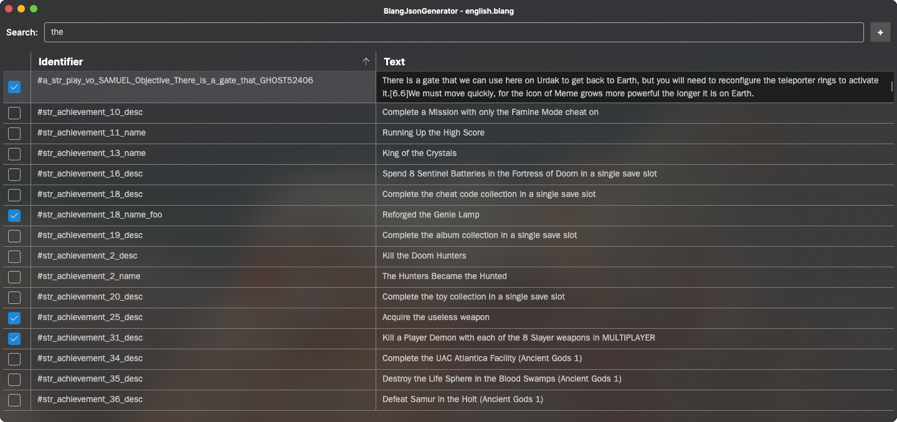

# BlangJsonGeneratorUI
GUI utility for creating string mods for DOOM Eternal.



## Features
* Reads both encrypted and unencrypted blang files.
* Supports loading blang files from .resources files without extracting them first.
* Supports loading previously made string JSONs to continue editing.
* Easy to use; has tooltips, links to string modding guides, supports dragging and dropping files, etc.
* Cross-platform; supports all major OSes.

## Usage
First, make sure you have the [.NET 6 Runtime](https://dotnet.microsoft.com/en-us/download) installed.

Afterwards, just double click on the executable on Windows and macOS, or run it from the terminal on Linux.

## Compiling
First, make sure you have the [.NET 6 SDK](https://dotnet.microsoft.com/en-us/download) installed.

Then, from a terminal, run:

```
git clone https://github.com/PowerBall253/BlangJsonGeneratorUI.git
cd BlangJsonGeneratorUI
dotnet publish -p:PublishProfile=FolderProfile -r <rid>
```

(Replace `<rid>` with `win10-x64` for Windows, `linux-x64` for Linux and `osx-x64` for macOS.)

The compiled binaries will be found in `BlangJsonGeneratorUI/BlangJsonGenerator/bin/Release/net6.0/publish/`.

## Special thanks to
* proteh: For the BlangParser library, which is used in this project.
